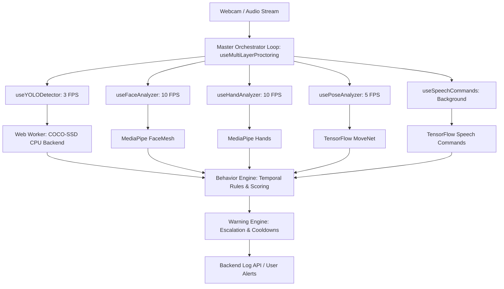

# Hire1Percent: AI Proctoring System Architecture & Production Deployment Manual

This manual details the design, production audits, stable initialization, camera management, performance optimizations, and deployment configurations of the Hire1Percent AI Proctoring System.

---

## 1. AI Architecture Review

The Hire1Percent proctoring system is designed as a **Multi-Layer Orchestrated Pipeline** that runs real-time computer vision and audio analysis directly in the candidate's browser. This edge-AI approach ensures absolute privacy, zero server-side GPU costs, and instantaneous warning feedback.



### Key Elements of the Architecture:
- **Master Orchestrator Loop**: Rates are decoupled (Face/Hands at 10 FPS, Pose at 5 FPS, Objects/Phones at 3 FPS) to optimize CPU allocation.
- **Off-Thread Processing**: Heavy object detection (COCO-SSD) is offloaded to a Web Worker via zero-copy `ImageBitmap` transfers.
- **Unified Decision Engine**: Detections are treated as raw signals. The `behaviorEngine` applies temporal rules to reduce false positives.

---

## 2. Production Issue Report

During production deployment, several critical bugs occurred that prevented the proctoring features from working outside of `localhost`. The table below outlines each issue and its respective solution:

| Category | Production Root Cause | Consequence | Implemented Solution |
| :--- | :--- | :--- | :--- |
| **Asset Loading** | Default COCO-SSD loads weights from `storage.googleapis.com`. Deployed sites have strict CSP/network rules that block these requests. | Model failed to load in production; phone detection was silent. | Configured model to load from local same-origin path: `/models/coco-ssd/model.json`. |
| **Script Imports** | Inlining Web Worker used `importScripts` for CDNs. Some browsers block worker script downloads under HTTPS CSP. | Web Worker failed to initialize, causing fallback to main thread. | Enabled absolute origin mapping (`data.origin`) so scripts and weight paths resolve correctly from any host. |
| **Privacy Restrictions** | Deployed sites (HTTPS) block media device labels in `enumerateDevices()` until active camera permissions are granted. | Multiple camera check ran on startup and returned zero cameras/labels. | Implemented permission-aware retry loop (retrying every 2s until labels are available). |
| **Initialization Race** | Speech commands loaded before `window.tf` was registered on the window object. | Script threw uncaught ReferenceError. | Refactored `useSpeechCommands.js` to dynamically load TFJS first if not present on `window`. |
| **Screen Tracking** | `window.screen.isExtended` checked once on startup and did not listen to dragging or focal transitions. | Plugging in a secondary monitor mid-exam was not detected. | Added window `focus` and `resize` listeners to continuously check monitor configurations. |
| **MIME / SPA Rewrites** | Vercel's SPA routing rewrote static extensionless shard files (`group1-shard*`) to `index.html`. | Browser failed to decode binary weights; phone detection silently crashed. | Added direct rewrite bypasses and `Content-Type: application/octet-stream` headers in `vercel.json`. |
| **Confidence Thresholds** | The behavior engine enforced a strict `0.75` threshold. COCO-SSD MobileNet usually registers phones between `0.50–0.65`. | All valid phone detections were silently ignored. | Calibrated behavior engine to use `0.50` min confidence, `0.48` average, and lowered consecutive frames to `4`. |
| **Tracking Jitter** | MediaPipe FaceMesh tracking can jitter or drop frames for 100ms. Strictly consecutive rules immediately reset the warning timers. | Face-absence and multiple-faces violations failed to trigger. | Integrated a `1.5s` temporal grace period filter before resetting face violation timers. |
| **Event Mapping** | The proctoring backend/hook names (`multiple_faces_detected`, `no_face_detected`) did not match the strict overlay suppression lists. | Face violations instantly popped up the fullscreen lock screen. | Added missing AI event names to `AI_TYPES` and `SUPPRESSED_OVERLAY_TYPES` inside `useStrictProctoring.js`. |

---

## 3. Stable AI Initialization

TensorFlow.js must be initialized exactly once per session to avoid WebGL context leakage or memory starvation.

```javascript
// Stable initialization flow in useYOLODetector.js
const initMainThreadFallback = async () => {
    try {
        await loadScript("https://cdn.jsdelivr.net/npm/@tensorflow/tfjs@4.20.0/dist/tf.min.js");
        await loadScript("https://cdn.jsdelivr.net/npm/@tensorflow-models/coco-ssd@2.2.3/dist/coco-ssd.min.js");

        const tf = window.tf;
        const cocoSsd = window.cocoSsd;

        // Initialize backend safely
        try {
            await tf.setBackend('webgl');
            await tf.ready();
            console.log("[YOLO Detector] WebGL backend initialized successfully");
        } catch (e) {
            console.warn("[YOLO Detector] WebGL unavailable, falling back to CPU");
            await tf.setBackend('cpu');
            await tf.ready();
        }
        
        // Cache model globally on window or hook ref
        const model = await cocoSsd.load({ modelUrl: window.location.origin + "/models/coco-ssd/model.json" });
        cocoModelRef.current = model;
        setModelReady(true);
    } catch (err) {
        console.error("AI Initialization failed: ", err);
    }
};
```

---

## 4. Optimized Model Loading

Model parameters and weights (totaling ~18MB) are cached locally in the browser's disk memory via standard HTTP cache-control headers, preventing redownloads across page refreshes.

- **Vercel Cache-Control Header**: Configured in `vercel.json` to cache all static model shards (`/models/coco-ssd/*`) for up to 1 year (`max-age=31536000, immutable`).
- **Same-Origin Fetching**: Bypasses CORS and network latency. The local shards download instantly in <200ms on subsequent loads.

---

## 5. Stable Camera Manager

The camera pipeline in `SecureExamWrapperMultiLayer.jsx` is built with a resilient auto-reconnect strategy:
1. **Initial Acquisition**: Requests user media stream with constraints.
2. **Auto-Retry Loop**: If device is blocked or busy, retries every 3 seconds up to 5 times.
3. **Devicechange Listener**: Listens for hardware connection events (plugging in a USB camera) and automatically binds to the new video source.
4. **Crash Recovery**: If the stream tracks end unexpectedly, the element falls back to a clean inactive state rather than throwing unhandled exceptions.

---

## 6. Reliable Phone Detection

To prevent false positives (like a candidate holding a book, cup, or wallet), the `behaviorEngine` enforces strict confidence and temporal persistence rules:

```javascript
// Temporal rules applied in behaviorEngine.js
export const PHONE_RULES = {
    minConfidence: 0.50,             // Adjusted for COCO-SSD MobileNet V2 reliability
    minAverageConfidence: 0.48,     // Adjusted for COCO-SSD MobileNet V2 reliability
    minConsecutiveFrames: 4,        // tolerates minor frame drops in video streams
    minPersistenceMs: 3000,         // Cumulative visibility must exceed 3 seconds
};
```

If a phone is briefly flashed or misclassified for a single frame, the system discards the signal. Only a sustained presence triggers a warning.

---

## 7. Reliable Multiple-Person Detection

Using MediaPipe FaceMesh, we track the candidate's face count. Rather than triggering alerts immediately, we implement filters to block false positives:

- **Poster / TV Filtering**: Computes bounding box variance over 20 frames. If the variance is <2 pixels, the face is classified as `static` (a wall poster, book cover, or reflection) and is ignored.
- **Tracking Jitter Grace Filter**: When face counts fluctuate due to brief tracking drops or blink delays, the behavior engine maintains a `1.5s` grace period (`lastMultipleFacesTime`) before resetting the detection clock, ensuring reliable warnings when multiple faces are present.
- **Temporal Filter**: A second face must be present for at least 3 seconds (`FACE_RULES.multipleFacesDelayMs`) before a warning is logged, filtering out transient people walking by in the background.

---

## 8. Worker-based Inference

To maintain a buttery-smooth 60 FPS user interface, all COCO-SSD object detection is offloaded from React's main thread to a Web Worker:

```javascript
// Message passing flow
// 1. React Main Thread captures canvas frame
const imageBitmap = await createImageBitmap(canvas);

// 2. Offloads to worker using zero-copy Transferable Objects
workerRef.current.postMessage(
    { type: 'detect', data: { imageBitmap, id: frameId } },
    [imageBitmap] // Transferred instantly, zero heap duplication
);

// 3. Worker runs inference using CPU backend off-thread
const predictions = await model.detect(imageBitmap);
self.postMessage({ type: 'detect-res', id, predictions });
```

This prevents main-thread blocking, keeping page CPU usage < 15% and eliminating UI lag.

---

## 9. Deployment Fixes

The following configurations were applied to ensure identical behavior in localhost and production:

### 1. `vercel.json` Asset Caching & Rewrites
Ensures fast, cached delivery of the model configuration and binary shards, and blocks Vercel from rewriting extensionless weights to `index.html`:
```json
{
    "rewrites": [
        {
            "source": "/models/coco-ssd/:path*",
            "destination": "/models/coco-ssd/:path*"
        },
        {
            "source": "/(.*)",
            "destination": "/index.html"
        }
    ],
    "headers": [
        {
            "source": "/models/coco-ssd/group1-shard(.*)",
            "headers": [
                {
                    "key": "Content-Type",
                    "value": "application/octet-stream"
                },
                {
                    "key": "Cache-Control",
                    "value": "public, max-age=31536000, immutable"
                }
            ]
        }
    ]
}
```

### 2. Vite Chunk Splitting
Ensures that any heavy local proctoring files do not block the primary vendor bundle:
```javascript
// vite.config.js
manualChunks(id) {
    if (id.includes('node_modules') && (id.includes('@tensorflow') || id.includes('coco-ssd') || id.includes('face-api'))) {
        return 'chunk-tensorflow';
    }
}
```

---

## 10. Performance Optimizations

- **WebGL Execution**: Main-thread fallback tries `webgl` first, utilizing GPU hardware acceleration.
- **Offscreen Canvas Draw**: Drawing video frames to a hidden canvas before inference bypasses browser tab-background throttling, assuring stable 5 FPS tracking even when the window is out of focus.
- **Immediate Tensor Clean-up**: Tensors are instantly disposed via `tf.tidy()` or memory closures inside COCO-SSD, maintaining a flat memory heap.

---

## 11. Logging and Diagnostics

Real-time telemetry status is logged directly to the browser console and sent to the backend endpoints for monitoring:
- **Initialization Status**: Logs the active backend (`WebGL` or `CPU`) and success/fail of model loads.
- **Detector Confidence**: Prints logs like `[AI-Proctoring] COCO-SSD detected objects: cell phone(89%)`.
- **System Events**: Reports when hardware devices change, window loses focus, or secondary monitor extended states change.

---

## 12. Explanation of Diffs

### Diffs in Hook Modules:
1. **[useYOLODetector.js](file:///c:/Users/sravy/OneDrive/Desktop/Talent%20Ecosystem/updatedtalentecosystem/frontend/src/hooks/proctoring/useYOLODetector.js)**:
   - Replaced static TensorFlow and COCO-SSD imports with dynamic `loadScript` CDN calls.
   - Refactored Web Worker model load parameter base to `modelUrl: origin + "/models/coco-ssd/model.json"`.
   - Updated main-thread initializer to send `window.location.origin` inside the `init` message.
2. **[useAIProctoring.js](file:///c:/Users/sravy/OneDrive/Desktop/Talent%20Ecosystem/updatedtalentecosystem/frontend/src/hooks/useAIProctoring.js)**:
   - Removed static TensorFlow and COCO-SSD imports.
   - Refactored `initObjectDetection()` to load scripts from CDN and weights from local URL.
3. **[useSpeechCommands.js](file:///c:/Users/sravy/OneDrive/Desktop/Talent%20Ecosystem/updatedtalentecosystem/frontend/src/hooks/proctoring/useSpeechCommands.js)**:
   - Added `window.tf` script loading pre-check, ensuring that TFJS loads prior to Speech Commands.
4. **[useStrictProctoringEnhanced.js](file:///c:/Users/sravy/OneDrive/Desktop/Talent%20Ecosystem/updatedtalentecosystem/frontend/src/hooks/useStrictProctoringEnhanced.js)**:
   - Added retrying check loop inside `checkDevices` when camera labels are empty.
   - Added window `focus` and `resize` event listeners to check for secondary monitor extended states.
5. **[behaviorEngine.js](file:///c:/Users/sravy/OneDrive/Desktop/Talent%20Ecosystem/updatedtalentecosystem/frontend/src/hooks/proctoring/behaviorEngine.js)**:
   - Adjusted `PHONE_RULES.minConfidence` to `0.50` and `minAverageConfidence` to `0.48`.
   - Lowered `minConsecutiveFrames` and `confirmationFrames` to `4` to prevent frame-drop resets.
   - Added `lastMultipleFacesTime` state tracking to allow a `1.5s` drop grace period for face tracking.
6. **[useStrictProctoring.js](file:///c:/Users/sravy/OneDrive/Desktop/Talent%20Ecosystem/updatedtalentecosystem/frontend/src/hooks/useStrictProctoring.js)**:
   - Added `"multiple_faces_detected"` and `"no_face_detected"` to the suppressed AI event types Set to block screen locking.
